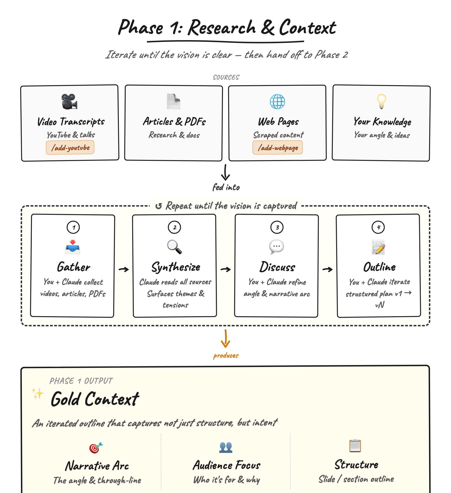
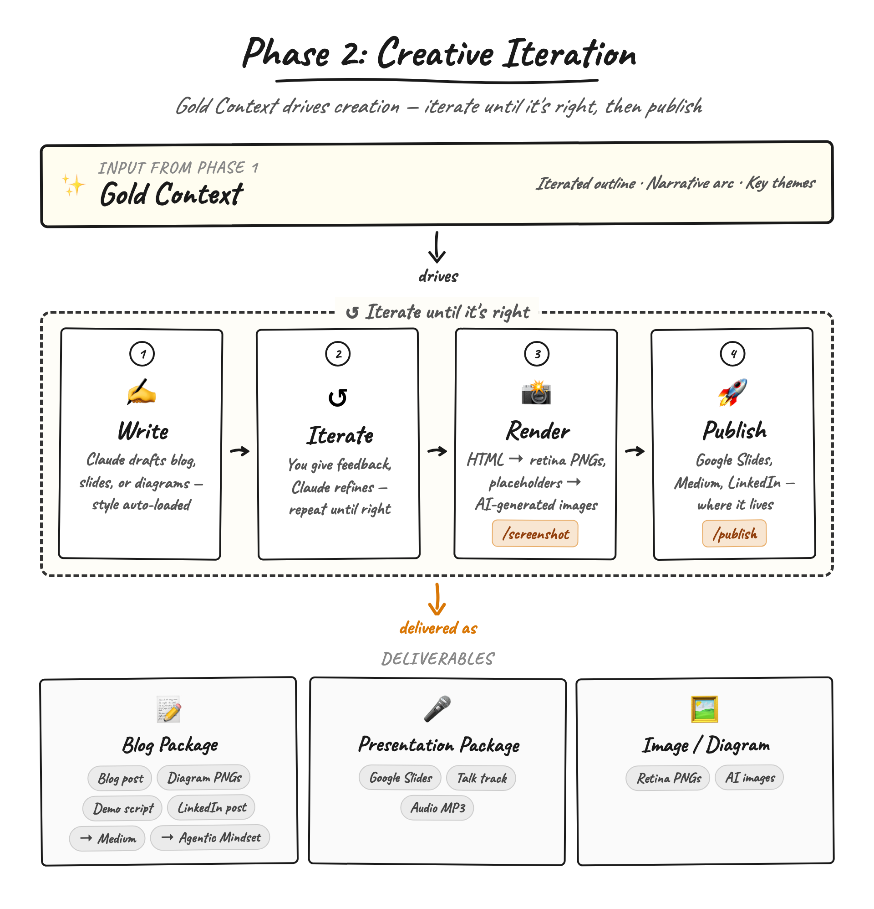
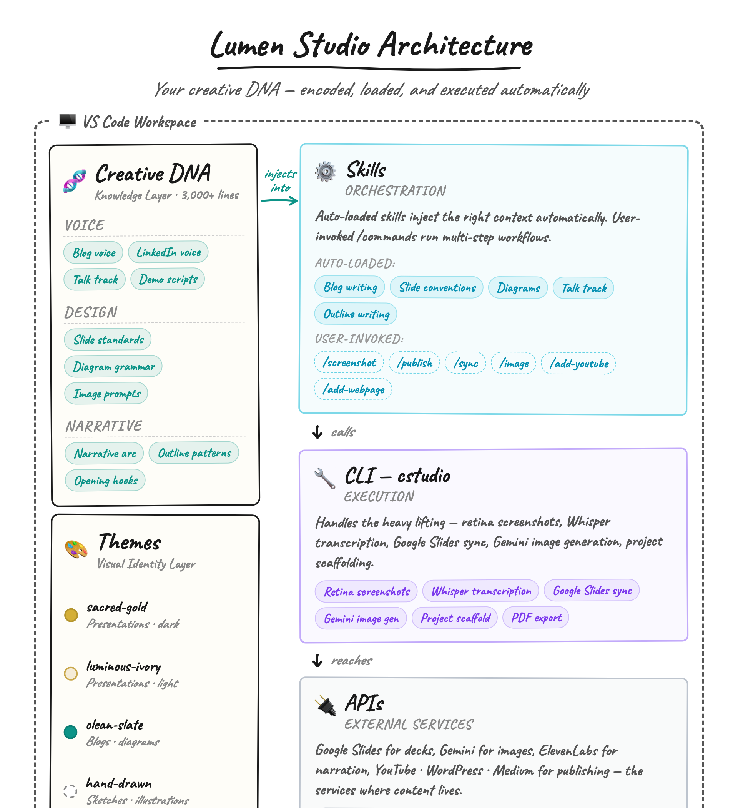

# Lumen Studio

A content creation agent that turns your IDE into a creative studio — built on [Claude Code](https://docs.anthropic.com/en/docs/claude-code) as its agentic runtime, with VS Code as the collaboration workspace.

Lumen doesn't just suggest things — it takes action. It scaffolds projects, gathers research, writes drafts, builds HTML slides and diagrams, generates AI images, captures pixel-perfect screenshots, and publishes to Google Slides. And it does all of it in your voice, with your design patterns, automatically.

[](https://www.youtube.com/watch?v=xbpQXnUWg00)

📺 **[Watch Demo Video](https://www.youtube.com/watch?v=xbpQXnUWg00)** | 📖 **[Read the Blog](https://agenticmindset.ai)**

*From blank folder to published Google Slides deck — project scaffold, YouTube and web research, source synthesis, 24-slide generation, Gemini image creation and iteration, and one-command publish.*

---

## The Two-Phase Workflow

Every content project — blog, presentation, or standalone image — follows the same two-phase pattern.

**Phase 1: Research & Context Creation** — iterate on understanding. Gather sources, synthesize themes, shape the narrative arc, and iterate the outline until it's right. The output is **Gold Context**: an iterated outline that captures not just structure, but intent.


*Phase 1: Gather → Synthesize → Discuss → Outline, repeating until the vision is captured.*

**Phase 2: Creative Iteration** — iterate on execution. Gold Context drives everything: writing, slides, diagrams, images, screenshots, publishing. Different outputs, same loop.


*Phase 2: Write → Iterate → Render → Publish, repeating until it's right.*

---

## Architecture

Lumen Studio has a four-layer architecture — all running inside VS Code:


*Creative DNA (style guides + themes) encodes how you write, design, and structure. Skills inject it automatically. The CLI handles execution. APIs connect to external services.*

| Layer | Role | What It Does |
| ----- | ---- | ------------ |
| **Creative DNA** | Knowledge | 3,000+ lines of style guides encoding your writing voice, narrative structure, slide design, and delivery style |
| **Skills** | Orchestration | Auto-loaded skills inject the right context when you open a file. User-invoked `/commands` run multi-step workflows |
| **CLI** | Execution | `cstudio` handles screenshots, image generation, Google Slides sync, transcription, project scaffolding |
| **APIs** | External Services | Google Slides, Gemini, ElevenLabs, YouTube, WordPress, Medium |

---

## Creative DNA — Your Voice, Encoded

This is the core insight: **if the agent produces it, teach the agent how you produce it.**

Without explicit style guides, AI output is competent but impersonal. Creative DNA changes that by encoding your specific patterns into versioned, reusable rules the agent loads automatically.

### Style Guides

The `writing/` directory contains **starter templates** — section headers and guidance for each style guide. Fill them with your own creative patterns to personalize Lumen's output. Add published exemplars to the `reference-*/` directories for voice calibration.

```text
library/
└── creative-dna/
    ├── writing/
    │   ├── blog-style-guide.md               ← add your voice, tone, structure
    │   ├── presentation-deck-style-guide.md  ← add your narrative architecture
    │   ├── talk-track-style-guide.md         ← add your delivery style
    │   ├── demo-script-style-guide.md        ← add your script format
    │   ├── linkedin-post-style-guide.md      ← add your hook patterns
    │   ├── reference-blogs/                  ← drop your published posts here
    │   ├── reference-demo-scripts/           ← drop your demo scripts here
    │   └── reference-linkedin-posts/         ← drop your LinkedIn posts here
    ├── slides/
    │   └── slide-standards.md                Layout, typography, build patterns
    ├── diagrams/
    │   └── diagram-standards.md              Flow direction, nodes, connectors
    └── videos/
        └── video-standards.md                Camtasia recording, script format
```

### Themes

Reusable visual identities assigned per project. A theme encodes the complete look: color palette, typography, spacing, component styles.

```text
library/
└── themes/
    ├── clean-slate/        Light background — blogs, diagrams, images
    ├── sacred-gold/        Dark background with gold accents — presentations
    ├── luminous-ivory/     Warm ivory with gold — presentations (light variant)
    └── hand-drawn/         Sketch aesthetic — informal diagrams, annotations
```

---

## Skills

Skills are the delivery mechanism — they ensure Creative DNA gets loaded at the right moment.

### Auto-Loaded Skills

Activate based on what you're editing. No invocation needed.

| Skill | Triggers On |
| ----- | ----------- |
| `blog-writing` | Editing blog markdown |
| `outline-writing` | Editing presentation outlines |
| `slide-conventions` | Editing slide HTML |
| `diagram-conventions` | Editing diagram HTML |
| `talk-track-writing` | Editing talk tracks |
| `video-script` | Editing demo scripts |
| `linkedin-writing` | Editing LinkedIn posts |

### User-Invoked Commands

| Command | What It Does |
| ------- | ------------ |
| `/new-project` | Scaffold a new project (presentation, blog, or image) |
| `/add-youtube` | Extract YouTube transcript into project context |
| `/add-webpage` | Extract webpage content into project context |
| `/screenshot` | Capture slides/diagrams as retina PNGs |
| `/image` | Generate an image for a slide placeholder via Gemini |
| `/publish` | Create a new Google Slides deck from all slides |
| `/sync` | Update slides in an existing Google Slides deck |
| `/export` | Export Google Slides deck as PDF |

---

## CLI — `cstudio`

The CLI handles execution. Skills call it, or you can use it directly.

```bash
python3 -m cstudio init <path> --theme <theme> --type <type> --name "Name"
python3 -m cstudio screenshot              # All slides → retina PNGs
python3 -m cstudio screenshot --slide 5    # Single slide
python3 -m cstudio publish                 # → new Google Slides deck
python3 -m cstudio sync                    # → update existing deck
python3 -m cstudio sync --slide 5          # → update single slide
python3 -m cstudio export                  # → PDF
python3 -m cstudio scrape <url>            # → extracted markdown
python3 -m cstudio transcribe <url>        # → Whisper transcription
```

Every project is driven by a `project.yaml` that configures the CLI — theme, slide list, output directories, Google Drive credentials.

---

## Project Types

| Type | Theme | Content | Published To |
| ---- | ----- | ------- | ------------ |
| **Presentation** | `sacred-gold` or `luminous-ivory` | HTML slides → Google Slides deck, talk track, audio, PDF | Google Slides |
| **Blog** | `clean-slate` | Blog markdown, HTML diagrams, demo video script, LinkedIn post | Medium, WordPress, YouTube |
| **Image** | `clean-slate` | HTML diagrams/visuals → retina PNGs | README, social, docs |

### Project Structure

```text
# Presentation                    # Blog
├── context/                      ├── context/
│   ├── gold/                     │   ├── gold/
│   ├── sources/                  │   ├── sources/
│   │   ├── transcripts/          │   │   ├── transcripts/
│   │   └── web/                  │   │   └── web/
│   └── prompts/                  │   └── prompts/
├── slides/                       ├── blog/
│   ├── screenshots/              ├── diagrams/
│   └── images/                   │   └── screenshots/
├── talk-track/                   ├── demo-video/
├── materials/                    ├── linkedin-post/
├── exports/                      └── project.yaml
└── project.yaml
```

---

## Repository Structure

```text
lumen-studio/
├── .claude/                     Claude Code integration
│   └── skills/                  Skills (orchestration layer)
├── library/                     Shared creative assets
│   ├── creative-dna/            Style guides, standards, components
│   │   ├── writing/             Blog, presentation, talk track, demo script guides
│   │   ├── slides/              Slide standards + reusable CSS components
│   │   ├── diagrams/            Diagram standards + reusable CSS components
│   │   ├── videos/              Video/recording standards
│   │   └── core/                Dimensions, build system, file naming
│   ├── themes/                  Visual themes (clean-slate, sacred-gold, etc.)
│   └── project-templates/       Scaffolding templates for cstudio init
├── tools/                       All tooling code
│   └── cstudio/                 CLI package (python3 -m cstudio)
├── projects/                    Content projects
│   ├── personal/
│   │   └── ocia/2025-12-Beatitudes/  Example project (24-slide presentation)
│   └── professional/            Your blog, image, and presentation projects
├── docs/                        Design docs and architecture diagrams
├── CLAUDE.md                    Lumen Studio agent instructions
└── README.md
```

---

## Getting Started

### Prerequisites

- Python 3.11+
- Chrome (for Selenium-based screenshots)
- [Claude Code](https://docs.anthropic.com/en/docs/claude-code) installed and configured

### Install

```bash
pip install -r requirements.txt
```

### Configure Credentials

Lumen connects to external services for image generation, Google Slides publishing, and more. Credentials are stored outside the repo and referenced via a `.env` file.

1. **Create a credentials directory** anywhere on your machine:

   ```text
   my-credentials/
   ├── client_secret_*.json   Google OAuth client secret (from Google Cloud Console)
   ├── token.pickle           Cached OAuth token (auto-generated on first auth)
   └── gemini.key             Google Gemini API key
   ```

2. **Set up Google OAuth** — Create an OAuth 2.0 Client ID in the [Google Cloud Console](https://console.cloud.google.com/apis/credentials) with the Google Slides API and Google Drive API enabled. Download the client secret JSON into your credentials directory.

3. **Get a Gemini API key** — From [Google AI Studio](https://aistudio.google.com/apikey). Save it as `gemini.key` in your credentials directory.

4. **Point Lumen to your credentials** — Copy `.env.example` to `.env` and set the path:

   ```bash
   cp .env.example .env
   ```

   ```text
   CSTUDIO_CREDENTIALS_DIR=/path/to/my-credentials
   ```

   The first time you run `/publish` or `/sync`, a browser window will open for Google OAuth. The token is cached in `token.pickle` — you only authenticate once.

### Create Your First Project

```bash
python3 -m cstudio init projects/professional/blogs/2026-04-my-post/ \
  --theme clean-slate --type blog --name "My Blog Post"
```

Open the project in VS Code with Claude Code. Lumen's skills activate automatically as you work.

---

## Read More

- **Blog**: [Encoding Your Creative DNA: How I Turned My Content Workflow into an AI Agent](https://agenticmindset.ai)
- **Demo Video**: [Watch on YouTube](https://www.youtube.com/watch?v=xbpQXnUWg00)
- **Author**: [George Vetticaden](https://linkedin.com/in/georgevetticaden) — founder of [Agentic Mindset](https://agenticmindset.ai)
